# Screenshots

A visual walkthrough of family-pool — a self-hosted app for splitting recurring
shared costs (Spotify-style cost-split pools) and running rotating savings pots
(arisan) inside invite-only rooms. See the [README](../README.md) for the stack
and local setup, and [PLAN.md](../PLAN.md) for the full build plan.

All screenshots below are from a real running instance with demo data — not
mockups.

## Login

Passwordless, magic-link-only auth. No passwords to manage, ever.

## Dashboard

Rooms you're in, a rollup of what you owe across all of them, and — if you own
a room — how many receipt approvals are waiting on you.

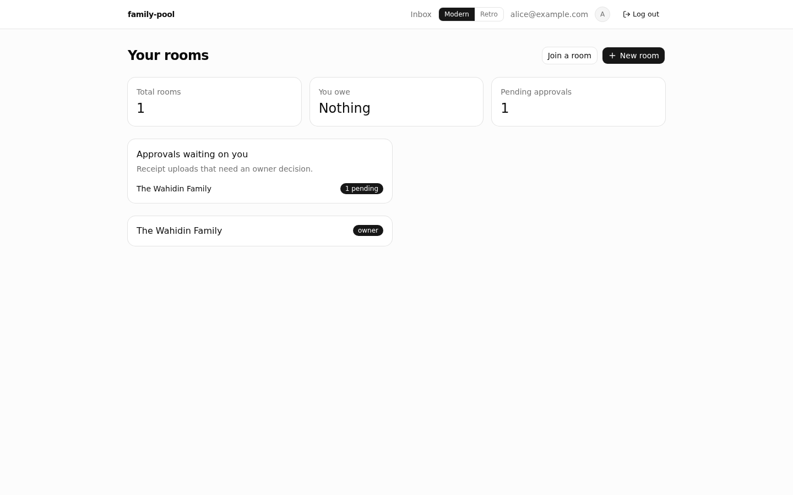

## Rooms

A room holds the pools a family shares. Owners manage members and pools;
everyone else just participates.

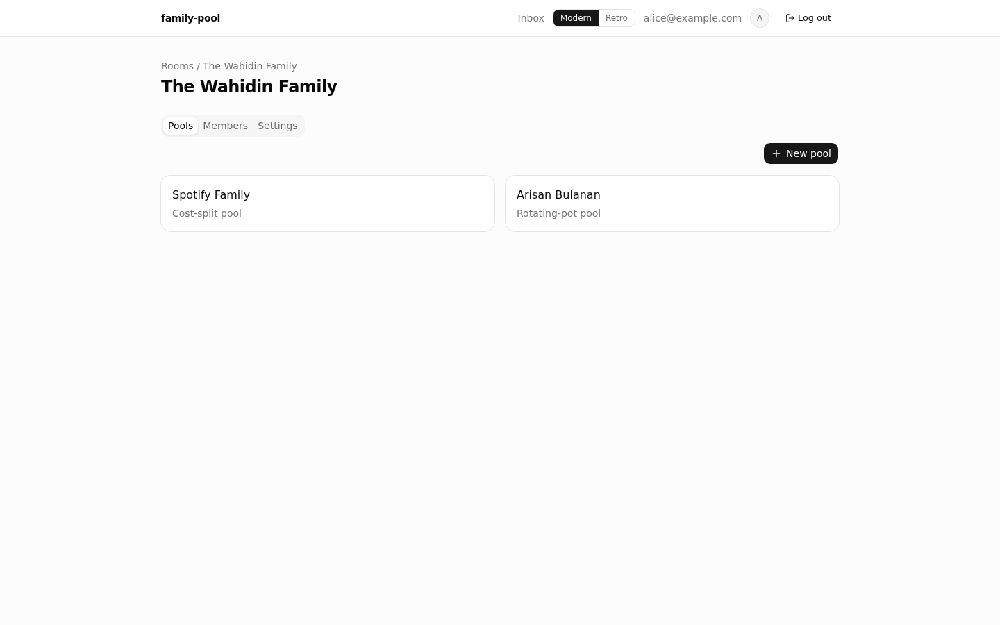

Creating a pool picks between a recurring cost-split or a rotating-pot arisan:

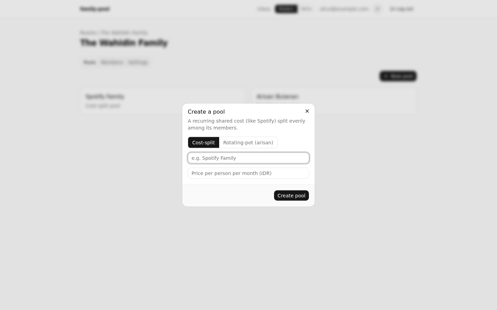

Members tab, and the Settings tab with the room's reusable invite link:

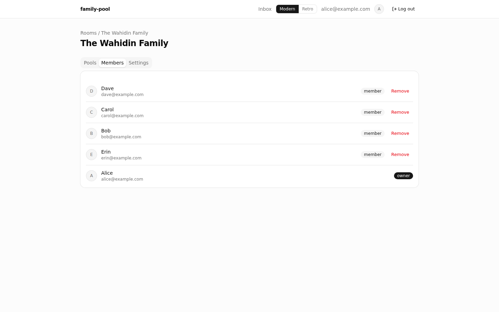
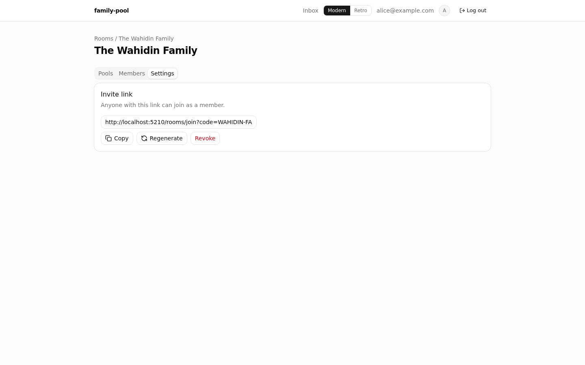

## Cost-split pools

Balance and "paid through" period are computed live from an append-only
ledger — never stored directly — so price changes and per-member overrides
(see Erin's row below) are reflected correctly without ever rewriting history.
Receipt uploads go through OCR extraction, an uploader confirmation step, then
owner approval before they touch the ledger.

## Rotating-pot pools (arisan)

Each round, one member is drawn at random to receive that round's pot.
Everyone wins exactly once per cycle — the app tracks who's left, runs the
draw, and won't let a cycle restart until every member has won.

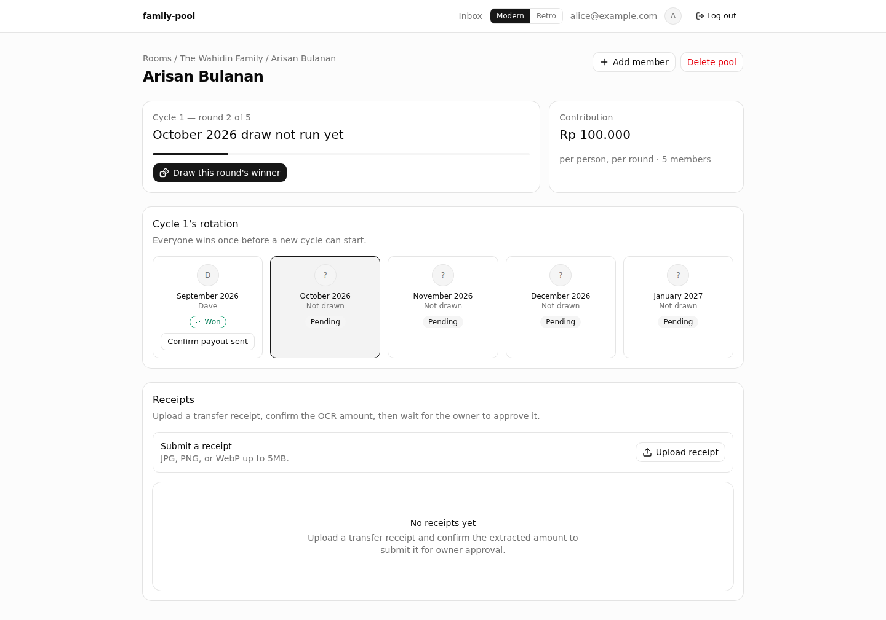

## Approval inbox

Every room you own, in one place — pending receipt uploads waiting on your
approve/reject decision, with the uploader's confirmed amount and the OCR
system's best guess side by side.

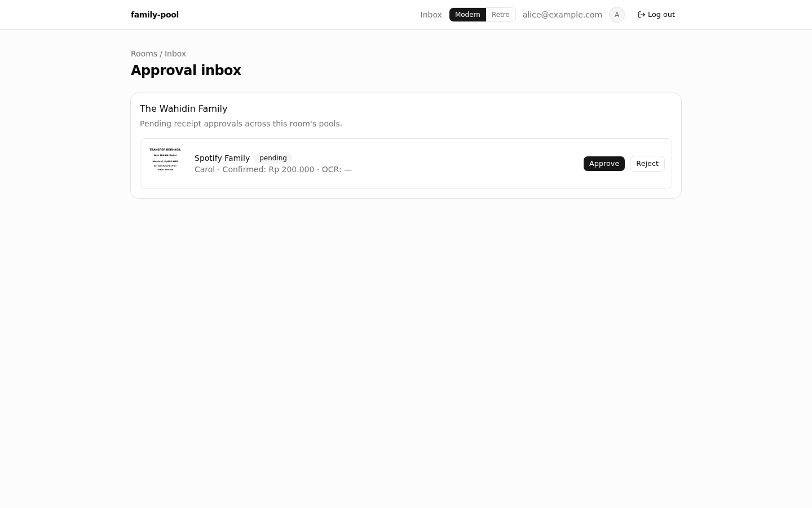

## Two themes

A modern default and a full retro theme — implemented as pure CSS keyed off
shared component slots, so every screen in this doc renders correctly in
either with zero per-component forking.

| Modern | Retro |
| --- | --- |
| 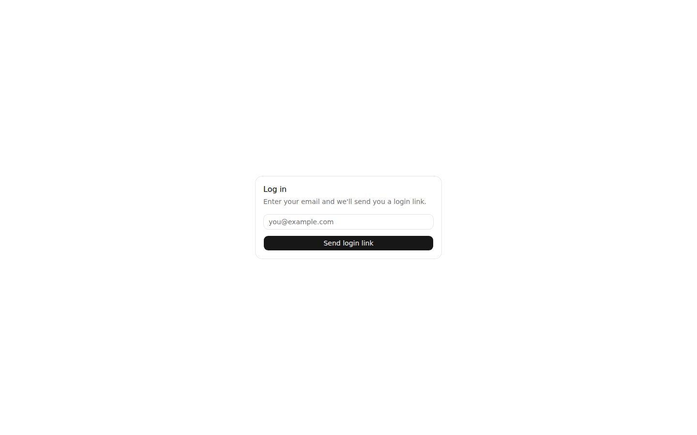 | 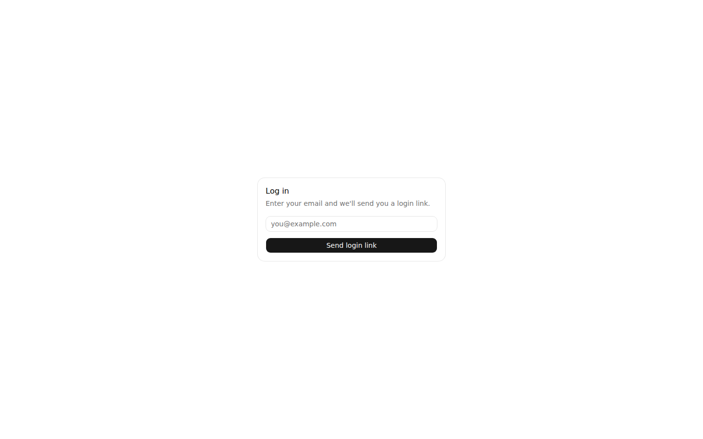 |
| 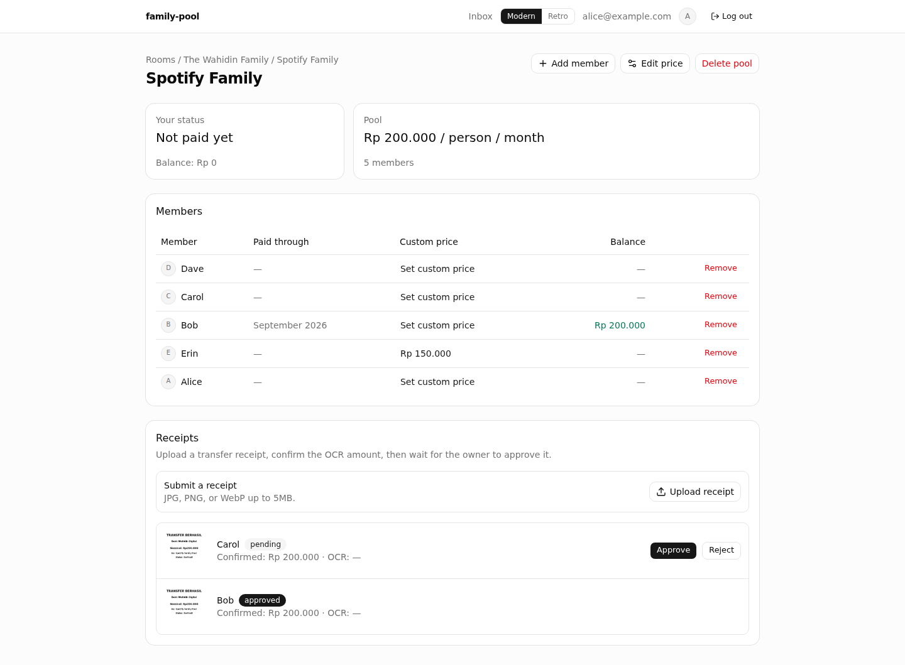 | 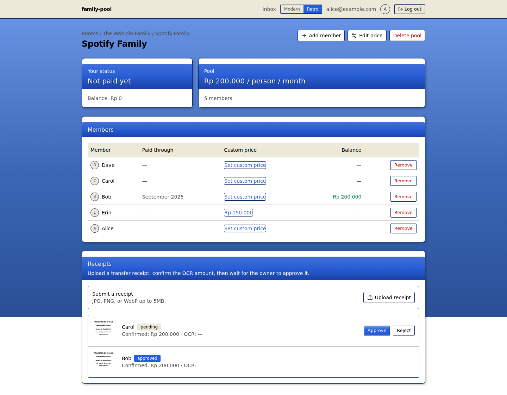 |

## Mobile

Built mobile-first from the start, since receipt photos mostly get uploaded
from a phone.

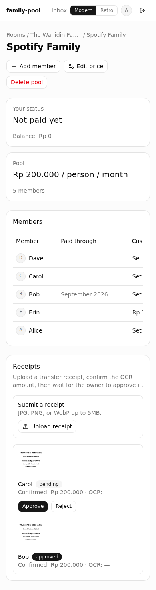
